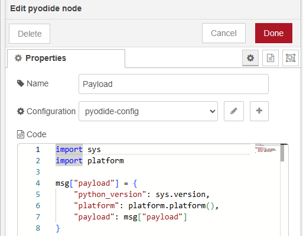
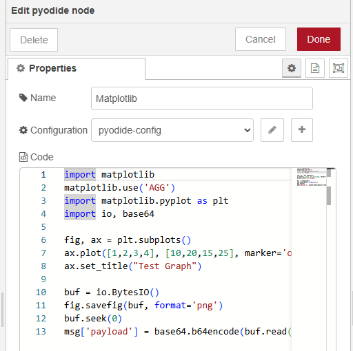
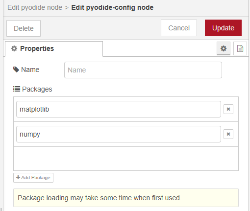
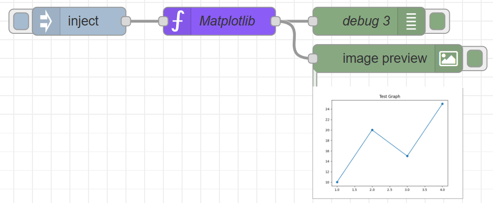

# node-red-contrib-pyodide

A Node-RED node that allows you to execute Python code using Pyodide.

## Overview

This node brings the power of Python to Node-RED without requiring a separate Python installation. It uses Pyodide to run Python code directly in the Node.js environment.

## Features

- ✨ Execute Python code directly in Node-RED
- 🔧 No Python installation required
- 🌐 Web-based Python using WebAssembly (Pyodide)
- � Automatic Python package loading (numpy, matplotlib, pandas, etc.)
- �🔄 Seamless integration with Node-RED message flow

## Usage
You can execute Python code with Pyodide.  
The sample flow demonstrates basic usage of the pyodide node with an inject node and debug node.

For example, You can use matplotlib in the pyodide node to generate graphs and pass them to the next node for display. The pyodide-config node loads the matplotlib package automatically.

# Others

Using Pyodide Part 1 (Execute in Browser)  
<https://404background.com/program/pyodide/>

Using Pyodide Part 2 (Execute with Node.js)  
<https://404background.com/program/pyodide-2/>

My Node: python-venv node  
<https://flows.nodered.org/node/@background404/node-red-contrib-python-venv>

