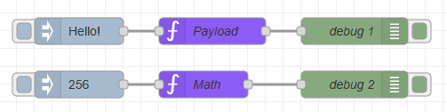
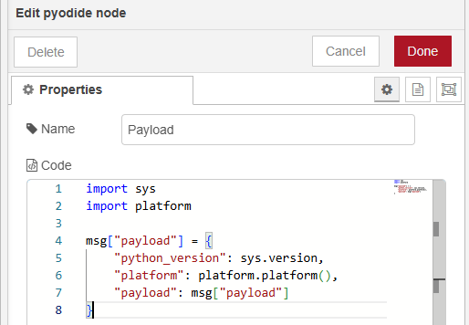

# node-red-contrib-pyodide

A Node-RED node that allows you to execute Python code using Pyodide (Python scientific stack compiled to WebAssembly).

## Overview

This node brings the power of Python to Node-RED without requiring a separate Python installation. It uses Pyodide to run Python code directly in the Node.js environment, making it perfect for data processing, mathematical calculations, and scientific computing within your Node-RED flows.

## Features

- ✨ Execute Python code directly in Node-RED
- 🔧 No Python installation required
- 🌐 Web-based Python using WebAssembly (Pyodide)
- 🔄 Seamless integration with Node-RED message flow

## Sample Flow




The sample flow demonstrates basic usage of the pyodide node with an inject node and debug node.

## Example

### Basic Usage
```python
msg["payload"] = "Hello from Python!"
```

### Mathematical Operations
```python
import math
result = math.sqrt(msg["payload"])
msg["payload"] = result
```

### System Information
```python
import sys
import platform

msg["payload"] = {
    "python_version": sys.version,
    "platform": platform.platform(),
    "pyodide_version": "0.27.7",
    "message": "Python is running in Pyodide!"
}
```
